Container image for D2 - a modern diagram scripting language that turns text to diagrams.

## Usage

### Render D2 diagram to SVG

```shell
docker run --rm -it --volume=$(pwd):/workspace ghcr.io/r-xs-fi/d2 example.d2 example.svg
```

Outputs:
```console
success: successfully compiled example.d2 to example.svg in 36.350921ms
```

## Supported platforms


| OS    | Architecture  | Supported | Example hardware |
|-------|---------------|-----------|-------------|
| Linux | amd64 | ✅       | Regular PCs (also known as x64-64) |
| Linux | arm64 | ✅       | Raspberry Pi with 64-bit OS, other single-board computers, Apple M1 etc. |
| Linux | arm/v7 | ❌ (Prebuilt image not available.)       | Raspberry Pi with 32-bit OS, older phones |
| Linux | riscv64 | ❌ (Prebuilt image not available.)       | More exotic hardware |

## FAQ

### Why not use the upstream image?

[Upstream](https://github.com/terrastruct/d2/blob/50d048f0a86f5076196e7906026ff20fefaf692d/ci/release/docker/Dockerfile) is ~ 700 MB, is weird and its build process is weird.

## How does this software get to me?

```mermaid
flowchart TD
    subgraph "Origin"
        sourcerepo["Original repo's pre-built binaries 🔗"]

        click sourcerepo "https://github.com/terrastruct/d2"
    end
    subgraph "Packaging build"
        rxsfi_build["r.xs.fi build (GitHub Actions)"]
    end
    subgraph "Container Registry"
        r_xs_fi_package_registry[ghcr.io/r-xs-fi/d2 🔗]

        click r_xs_fi_package_registry "https://ghcr.io/r-xs-fi/d2"
    end
    subgraph "user"
        docker_run[$ docker run ...]
    end
    sourcerepo -- download --> rxsfi_build
    rxsfi_build -- push --> r_xs_fi_package_registry
    r_xs_fi_package_registry -- pull --> docker_run[$ docker run ...]

```


